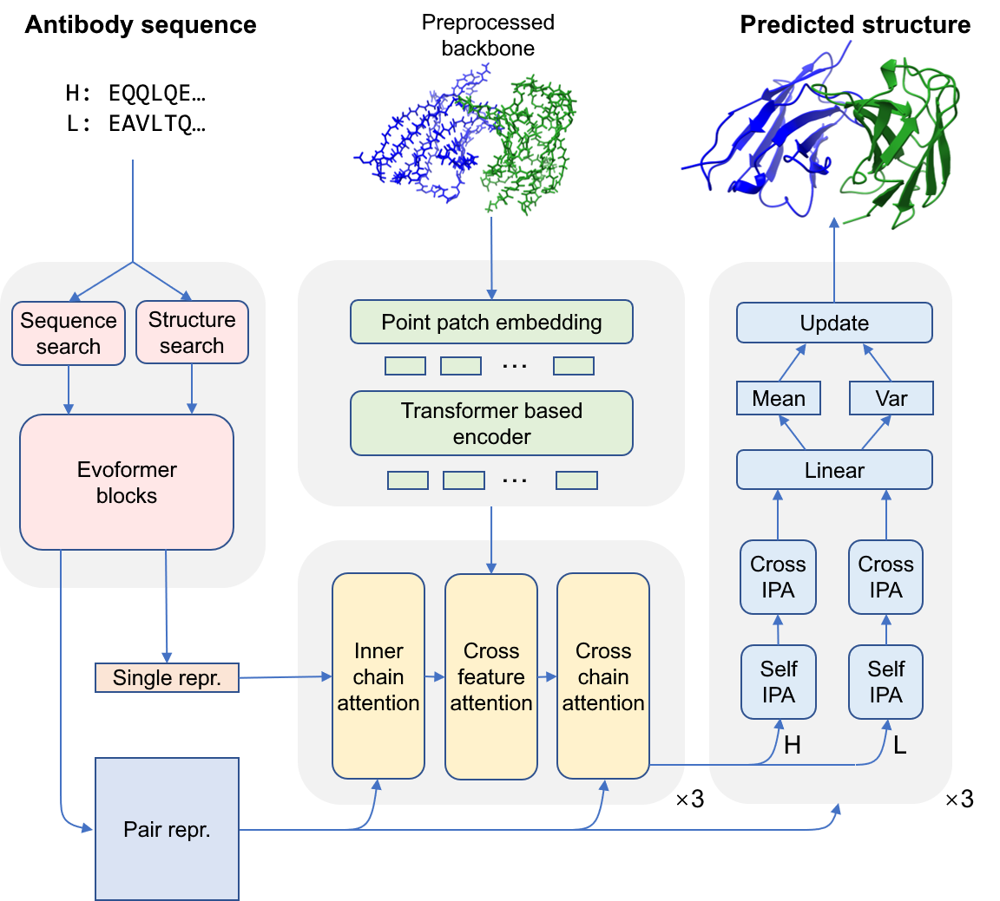

# AbFold

Official repository for [AbFold](): an AlphaFold Based Transfer Learning Model for Accurate Antibody Structure Prediction.



### Install

```shell
conda create -n abfold -f environment.yml
conda activate abfold
```

### Train


### 预测

```shell

```

